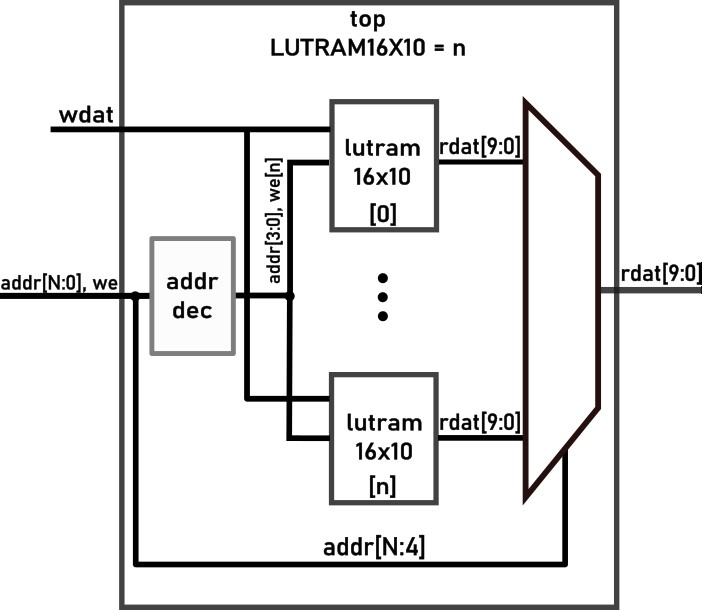

# LUTRAM_Stress_Test
Generic test of FPGAs LUTRAM capacities

## Testing strategy
16x10 distributed RAM is generated in a loop, specifically so the number of outputs and inputs stay the same from the top level module, employing an output read mux, and input address decoder. This test is design to assess the LUTRAM capabilites of the different FPGA vendors, coupled with their own propriatary tools, using a generic test which hides away the vendor-specific primitives.


## Reproduction steps
### Prerequsites
Gowin and CC propriatary toolchains for Synthesis and Place and Route. For simulation and verifying the design Verilator + GtkWave is used.
### Build steps
The top module provides a parameter `LUTRAM16X10` which is to set the number of 16x10 modules instantiated in the design. Once set, to run the GateMate toolchain run the following commands:
```
cd 3.build
make hw_all
```
Afterwards, check the `3.build/log/impl.log` for the number of CPE used or the exact error provided.

Gowin propriatary toolchain is provided in GUI form only, start the project, run synhtesis and PnR, and check the Synhtesis report.

If for any reason you want to simulate the design run `make` in `2.sim`, for CCGM1A1 post-synthesis and post-pnr sims are avaliable also.
## Results
### Gowin GW2AR-18C
Tool settings: Placer-1 priority to routability, Router-0 default, max fanout 23

Synthesis maximum numbers:

    - 314 modules instantiated
    - Logic elements 15058/20736
        - 11170 LUT
        - 648 RAM16S4 SSRAM
    - 15680/15750 DFF
    Error: Failed to place 10767 REG(s)

PnR included maximum numbers:

    - 255 modules instantiated
    - Logic elements 10346/20736
        - 6458 LUT
        - 648 RAM16S4 SSRAM
    - 8000/15750 DFF
    Error: Failed to place 145 REG(s)


### CologneChip CCGM1A1 
Tool settings: om-3 (speed), tm-3(worst timing)

Synthesis only maximum numbers: N/A because the number of primitives used obtained by synhtesis isn't easily mappable to the final number of CPEs used which is known only after PnR. 

<!-- Synthesis maximum numbers:
    - 100 modules instantiated
    - Logic elements 15058/20480
        - 11170 LUT
        - 648 RAM16S4 SSRAM
    - 15680/15750 DFF
Error: Failed to place 10767 REG(s) -->

PnR included maximum numbers:

    - 24 modules instantiated
    - Logic elements 2255/20480
    - 1600/15750 DFF
    FATAL ERROR: CPE_OUTMUX congestion at Component 333 with 353


